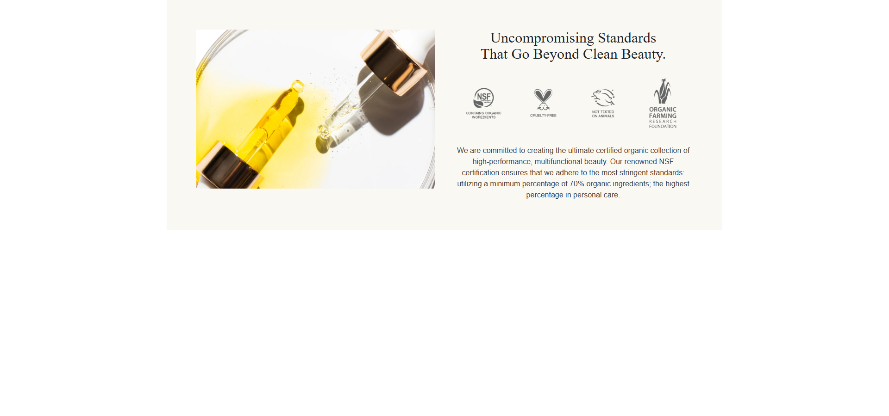
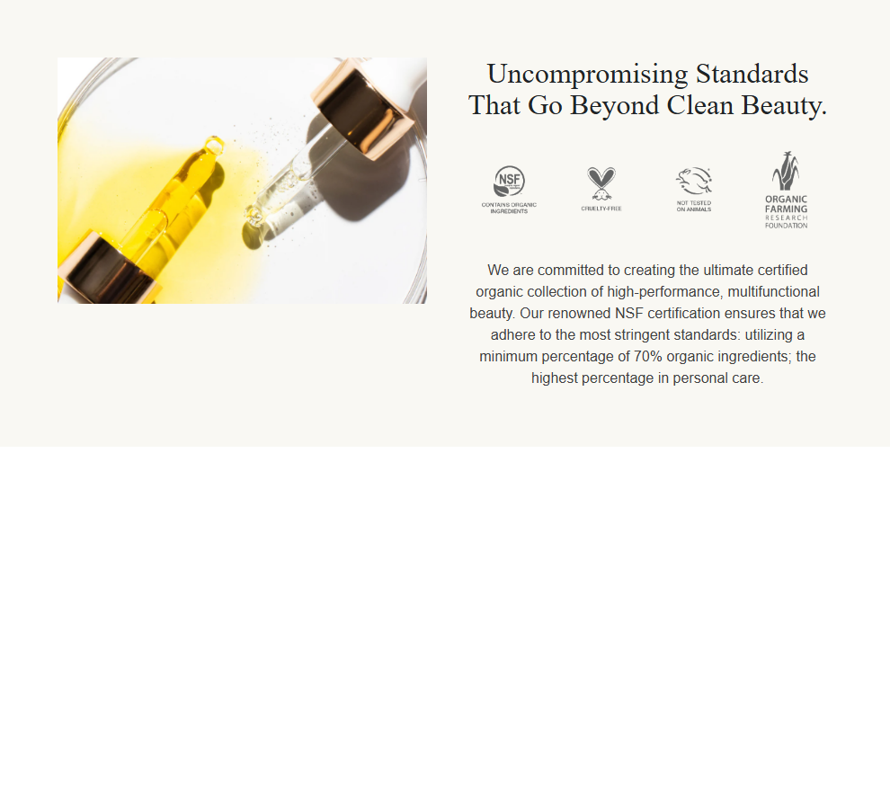
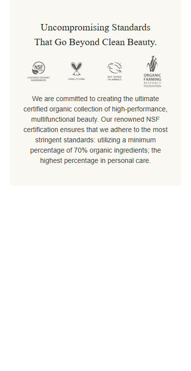

# Basecamp Summary: PDP Beyond Clean Certification Section

## Status

Completed and pushed on branch `codex/certification-section`.

Latest branch commits:

- `c1fb9b0` - Add PDP certification section
- `c4fb1dc` - Fix Shopify ignore directory patterns

## Summary

Implemented the PDP "Beyond clean certification" section from the Ogee PDP UI R5 Figma references.

The section now appears before product recommendations on the PDP and matches the Figma behavior:

- Desktop uses a centered `1200px` beige panel with image left and certification content right.
- Mobile uses a centered `350px` beige panel with no media image, only heading, seals, and copy.
- The colored panel is no longer full-bleed horizontally.
- The certification media and seal graphics are bundled as theme assets, with Shopify Theme Editor image overrides available.

## Task Log

Total active development duration: **6 hours**

| Task | Duration |
| --- | ---: |
| Reviewed Figma desktop node `11348:1388`, mobile node `11348:1809`, and supplied screenshots | 1.00h |
| Exported/prepared certification media and seal assets for the theme | 0.50h |
| Built the new Liquid section with schema settings and responsive image handling | 1.25h |
| Wired the section into `templates/product.json` before recommendations | 0.25h |
| Matched desktop/mobile spacing, typography, panel width, and mobile hidden-media behavior | 1.00h |
| Reviewed current browser screenshots and fixed the full-width beige background issue | 0.50h |
| Ran validation checks and captured desktop/tablet/mobile screenshots | 0.75h |
| Wrote compound report, PR markdown, and Basecamp handoff notes | 0.75h |

## Images

### Desktop Verification

### Tablet Verification

### Mobile Verification

### Theme Assets Added

## Files Changed

- `sections/beyond-clean-certification.liquid`
- `templates/product.json`
- `assets/ogee-certification-media.png`
- `assets/ogee-certification-seals.png`
- `.shopifyignore`
- `docs/changelog.md`
- `docs/solutions/design-patterns/2026-07-29-figma-pdp-certification-section.md`
- `docs/certification-section-pr-description.md`
- `docs/certification-section-basecamp-summary.md`
- `docs/pr-assets/certification-section/desktop.png`
- `docs/pr-assets/certification-section/tablet.png`
- `docs/pr-assets/certification-section/mobile.png`

## QA

Validation completed:

- Shopify Liquid validator revision 5 passed for the new section and product template.
- Local JSON/schema parsing passed.
- `git diff --check` passed.
- Playwright screenshots captured for desktop, tablet, and mobile.

Follow-up for final preview:

- Rerun `shopify theme dev --store ogee-li63n1as.myshopify.com --port 9292` locally, since Shopify CLI is available in the user PowerShell but not on the Codex shell PATH.
